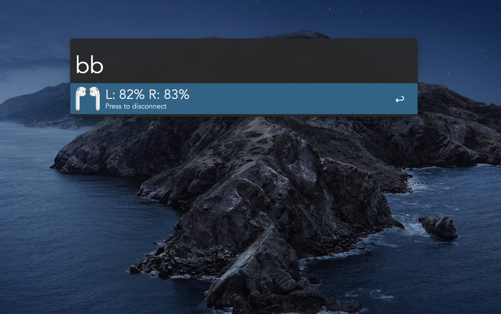
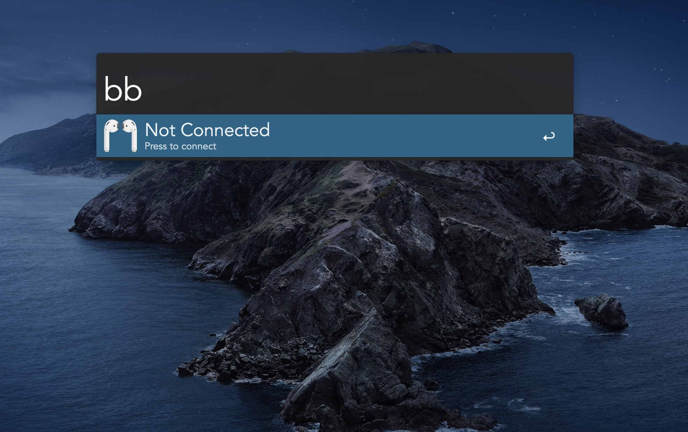
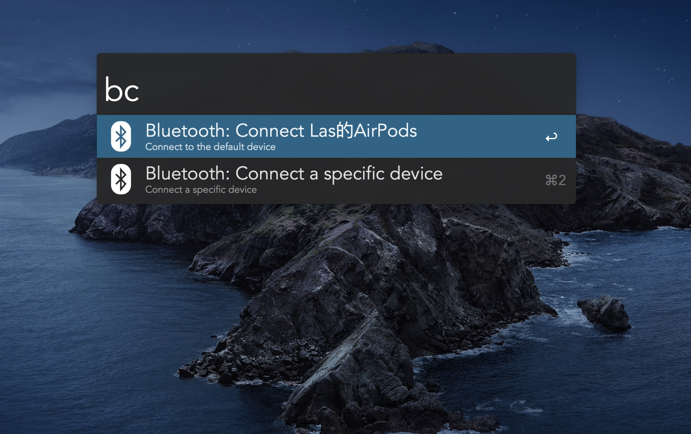

# AirpodsBattery 
An Alfred workflow to display the battery info of your connected Airpods.

This is a workflow used to display the battery of connected Airpods with the state of connection.

If the Bluetooth Manager workflow [Bluetooth Manager workflow](https://github.com/bmunoz89/alfred-wf-bluetooth-manager)
is installed, after selecting your Airpods as your default device through Bluetooth Manager, you can connect and disconnect your Airpods using Bluetooth Manager through this workflow conveniently.

## Requirements

1. Alfred Powerpack
2. (optional but recommned) [Bluetooth Manager workflow](https://github.com/bmunoz89/alfred-wf-bluetooth-manager)

## Install

Download the newest released file in [Releases](https://github.com/BeneathCloud/AirpodsBattery/releases), unzip and double click to intall.

## Usage

1. keyword `bb` to display connection status and battery of your Airpods.
2. After `bb`, you can press <kbd>Enter</kbd> to trigger Bluetooth Manager workflow to manage your Airpods.

## Notes

1. Highly recommended to install Bluetooth Manager workflow to enable features of connecting and disconnecting Airpods.

2. At present, this workflow can only work when you have only one pair of Airpods.

## Credits

1. Icons: [Flaticon](https://www.flaticon.com/)
2. The script based on: [AirPodsBatteryCLI](https://github.com/duk242/AirPodsBatteryCLI)
